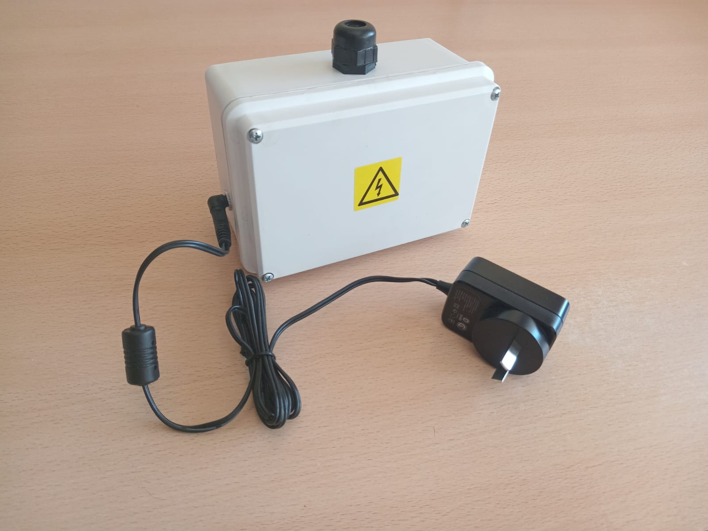
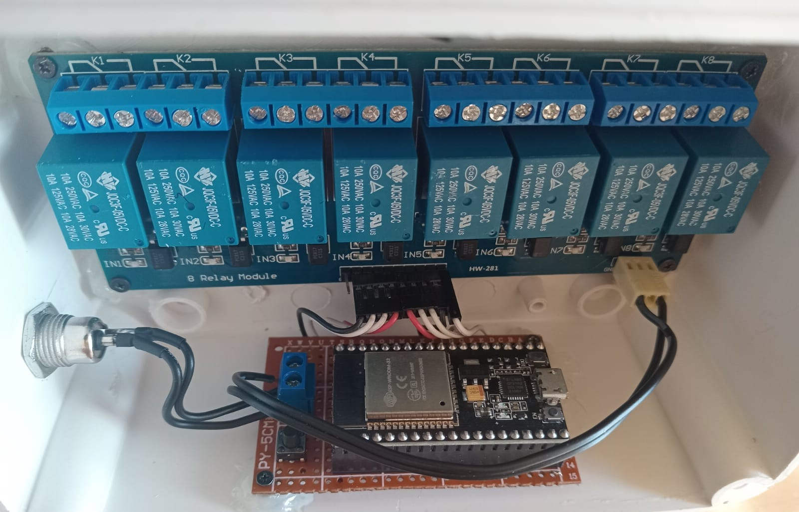
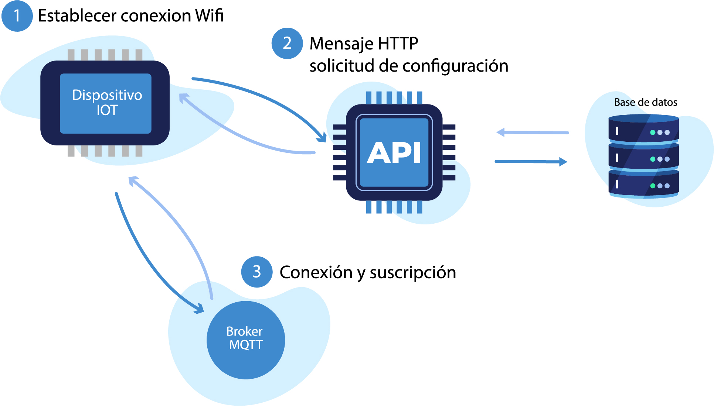
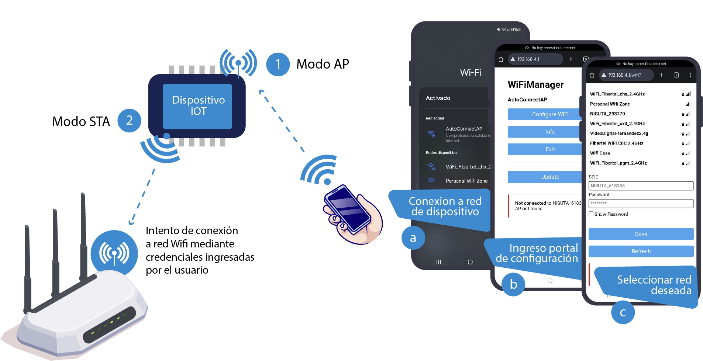
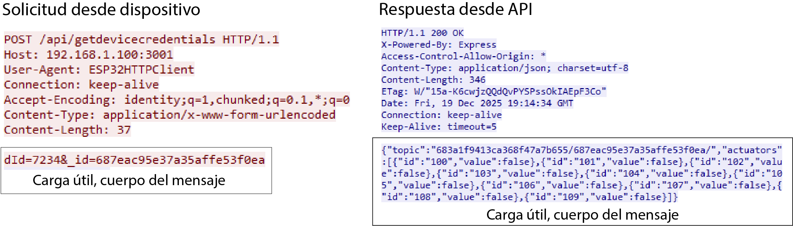
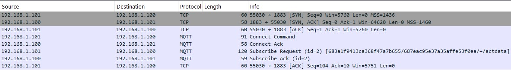
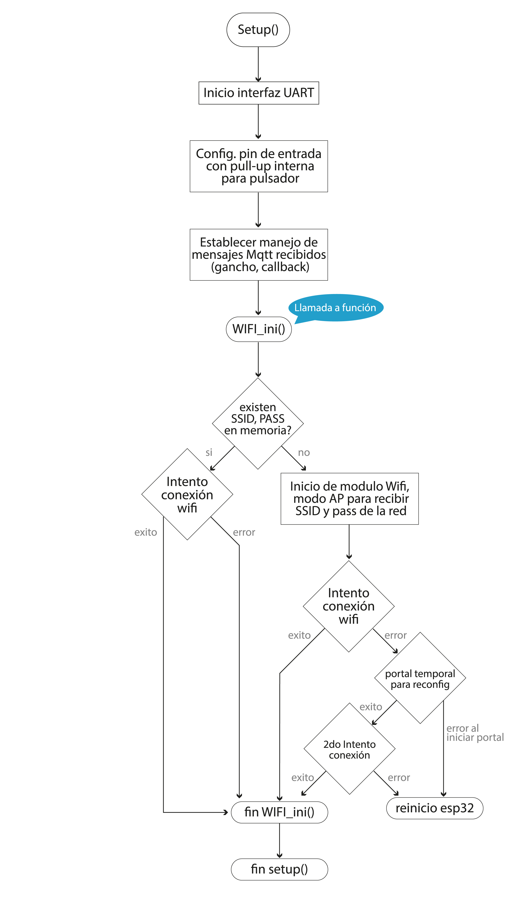
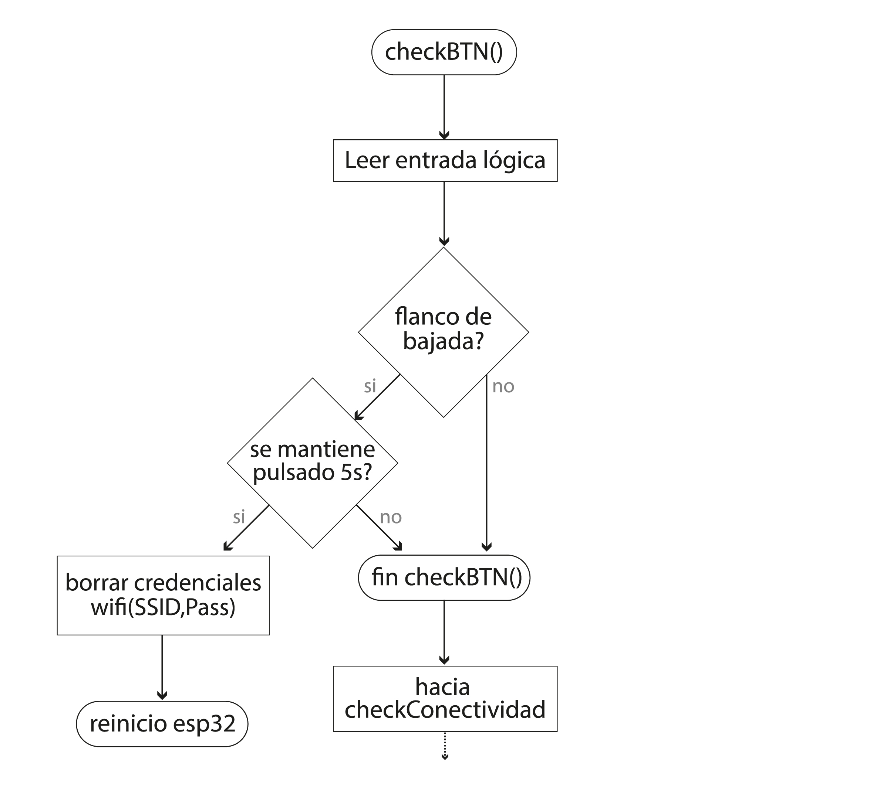
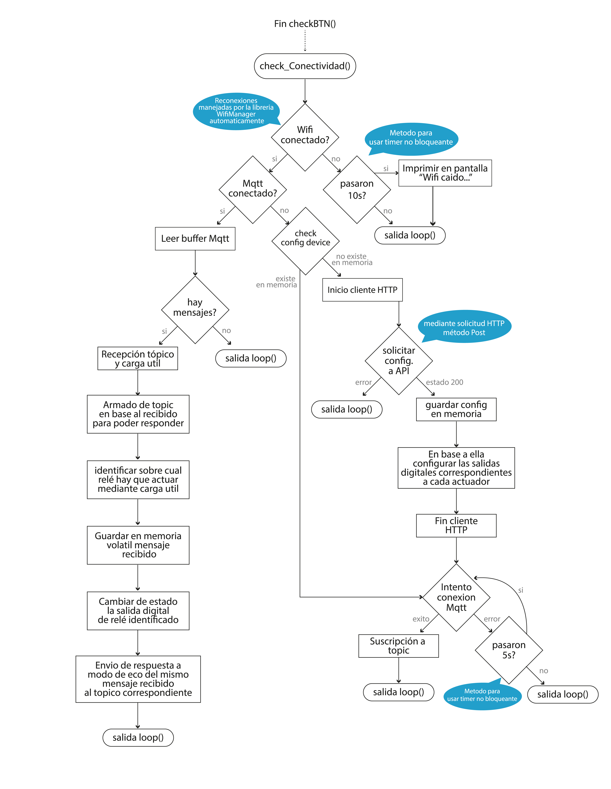

 <h1>ESP32 firmware -</h1>
  
Base en ESP32, testeado en la placa de desarrollo NodeMCU-32S. Este desarrollo forma parte de un sistema  prototipo, basado en IoT, para dar solucion a una problemática puntual de una empresa en particular.
  su tarea  es recibir mensajes mediante protocolo Mqtt y actuar sobre los controladores en base a él, notificando al  emisor una vez concluída su labor.
  Si desea comprender el código, puede apoyarse en los  <a href="#diagramas">
        diagramas de flujo
      </a>
 
  El documento completo del trabajo, donde se detalla el diseño conceptual y la arquitectura general del sistema  se encuentra disponible en:

🔗 https://github.com/adriangallicet/tesis-plataforma-iot

Se recomienda su lectura para comprender el enfoque integral del proyecto y su marco teórico.
  
  
  
  

 <h2>Comunicacion con el sistema</h1>
  
El dispositivo es solo una parte del sistema y, para llevar a cabo sus tareas, necesita comunicarse con las demás  entidades.
    El siguiente esquema muestra de manera resumida las relaciones llevadas a cabo.  Haz clic en los enlaces para ver más detalles. 

  

  <!-- Enlaces a secciones -->

  <ul>
    <li style="margin:0 0 6px 0;">
      <a href="#detalles-1">
        1) Establecer conexión Wifi
      </a>
    </li>
    <li style="margin:0 0 6px 0;">
      <a href="#detalles-2">
        2) Mensaje HTTP
      </a>
    </li>
    <li>
      <a href="#detalles-3">
        3) MQTT
      </a>
    </li>
  </ul>

 

   <section id="detalles-1">
    <h2 style="font-size:20px; margin-bottom:6px;">1. Establecer conexión Wifi</h2>
      

    Dicho procedimiento es llevado a cabo a través de la librería WifiManager. En un principio el dispositivo inicia en modo AP (access point), permitiendo que otros dispositivos puedan conectarse directamente a él creando su propia red Wi‑Fi con SSID (nombre de red) y una contraseña opcional. El objetivo es brindar al usuario un portal de configuración en una IP determinada (por defecto 192.168.4.1), de manera similar a la mayoría de routers o repetidores que podemos encontrar en el mercado. En él, veremos el listado de redes Wifi que se encuentran en el rango de señal del ESP32 y se podrá conectar a la de preferencia mediante sus respectivas credenciales. Una vez conectado, actúa como cliente de dicha red Wi-Fi, pasando de AP a modo STA(Station).
  

    
  </section>

   <section id="detalles-2" style="margin-top:24px;">
    <h2 style="font-size:20px; margin-bottom:6px;">2. Mensaje HTTP - solicitud de configuración</h2>
    
Al iniciar la placa, hay dos tipos de información que solicita mediante este medio al sistema, ya que no posee dichas configuraciones guardadas en memoria:

MQTT: se determina el tópico mediante el cual se realizará intercambio de mensajes futuros.

Actuadores: se especifica la cantidad de actuadores que se desea controlar y su último valor guardado en base de datos(es decir, true/false).

Mediante Wireshark, analizador de protocolos de código abierto, podemos ver este primer intercambio de mensajes del protocolo de hipertexto.

 
  </section>

   <section id="detalles-3" style="margin-top:24px;">
    <h2 style="font-size:20px; margin-bottom:6px;">3. Conexión y suscripción - MQTT</h2>
     
    
Se establece conexión al broker, en esta etapa de desarrollo con credenciales arbitrarias y, de tener éxito en el proceso, se realiza suscripción en base al tópico recibido anteriormente. En la siguiente captura se puede ver el establecimiento de la conexión vía TCP y los primeros intercambios de mensajes MQTT relacionados.

  </section>

  <section id="diagramas">
    <h2 style="font-size:20px; margin-bottom:6px;">Diagramas de flujo</h2>
      

     El framework Arduino define un punto de entrada único para el programa:  setup() se ejecuta una vez al iniciar, y loop() se ejecuta repetidamente mientras la placa esté encendida. En base a esta estructura base se lleva a cabo la solución.
       Con respecto a la estructura loop(), ella consta de 2 funciones: 

checkBTN(): detecta pulsaciones mantenidas del botón durante 5 segundos. Dado el caso, borrará las credenciales Wifi guardadas en memoria y reiniciará la placa. Esto, da la posibilidad de solucionar problemas sencillos de red que se puedan llegar a producir(por ejemplo, que se cambie SSID, Pass, o ambas de la red utilizada). A su vez, permite migrar el dispositivo a otra red, sin la necesidad de recompilar el programa.

checkConectividad(): como su nombre indica, su trabajo es asegurar las conexiones, tanto de red como cliente MQTT. A su vez, se encarga de recibir la configuración del dispositivo mediante HTTP desde base de datos y llevarla a cabo, manejo de mensajes MQTT y accionar sobre los relés.
  

  

    
     
      
   

  </section>
